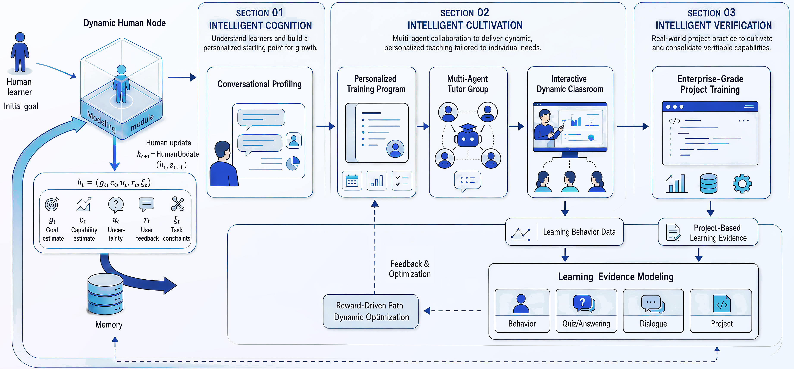
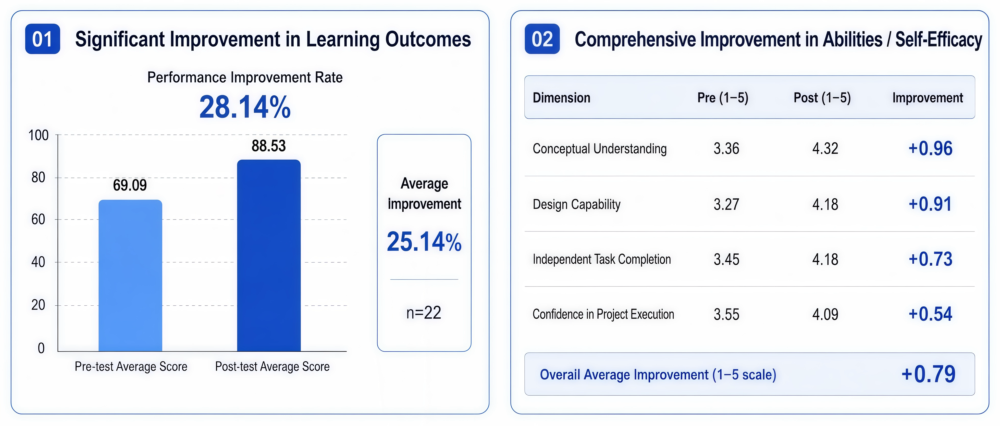
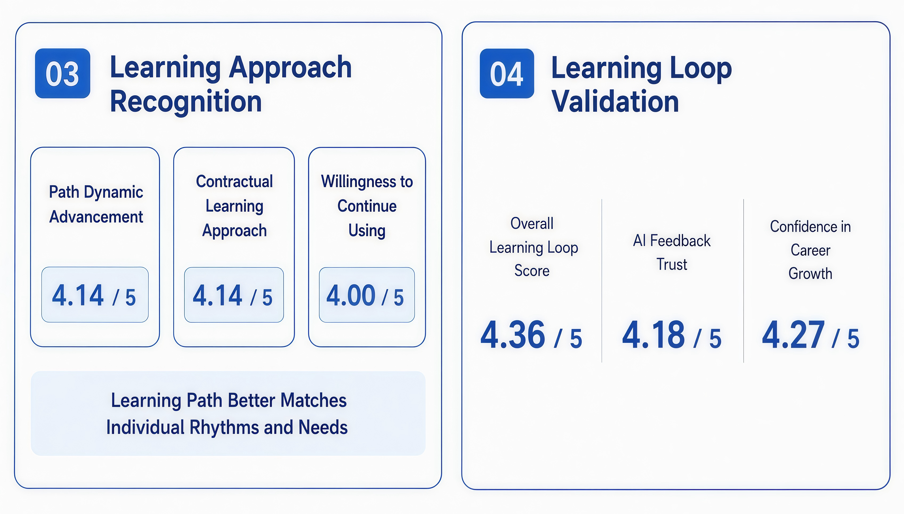
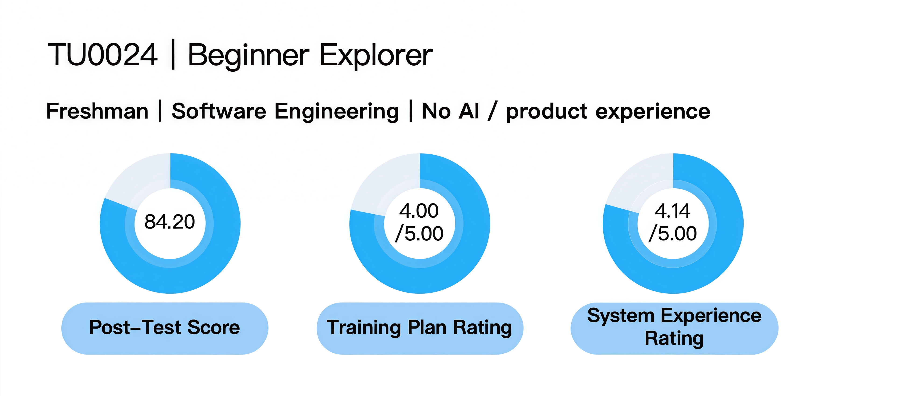
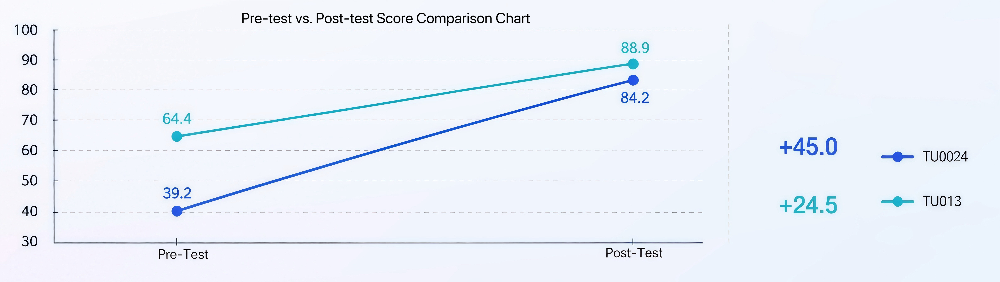

  
  <h1> 图灵学社 TuringUnion</h1>
  
<strong>One Learner, One University.</strong>

  

    
    
  

  

    <a href="./README.md">English</a> | <strong>中文</strong>
  

  <a href="https://agenticorglab.github.io/TuringUnion/"><strong>观看图灵学社宣传片与精选演示 →</strong></a>

### 🎓 项目概述

图灵学社是一个面向 AI 时代个性化教育的多智能体自治教育引擎。系统以“一人一大学”为目标，通过学习者画像、路径规划、多智能体导师协同、动态课堂生成和企业级项目实训，构建可反馈、可调整、可沉淀的个性化培养闭环。

系统关注的核心问题是传统教育中的结构性限制：

- 教学方式单一
- 师生资源不均衡
- 课程体系固化
- 学习与实践脱节

这些限制共同导致传统教育难以同时满足：

- 个性强
- 效率高
- 规模化

图灵学社的设计目标，是将学习者从适应固定课程体系的角色，转变为由系统围绕其目标、基础、节奏和实践表现动态组织学习资源的中心节点。

### 🎯 系统目标

图灵学社围绕三个目标构建：

- 持续理解学习者：通过多轮对话和学习行为采集，建立动态学习者画像。
- 动态组织培养过程：根据画像和学习证据生成并调整学习路径、导师配置和课堂内容。
- 验证真实能力：通过企业级项目、代码评审和过程证据沉淀，形成可信能力凭证。

系统中的每一次对话、答题、练习、项目提交和反馈都会进入学习证据体系，并用于后续路径优化、导师调度和能力评估。下面的核心模块对应这一培养链路中的主要能力。

### 🧩 系统框架

图灵学社采用“智能认知—智能培养—智能验证”的三段式框架。系统首先将学习者目标、能力、反馈和任务约束建模为动态人类节点，再通过个性化培养方案、多智能体导师团和交互式动态课堂组织学习过程，最后以企业级项目实训和学习证据建模验证真实能力，并将结果反馈给路径优化模块。

  

### 🤖 核心模块

#### 对话式画像建模

画像建模是系统的入口模块。校长智能体通过多轮对话识别学习者的职业目标、知识基础、能力短板和学习偏好。该画像会随着学习行为和反馈持续更新，形成动态学习者模型。

#### 个性化培养方案

系统基于学习者画像生成阶段化学习路径。以“Agent 开发工程师”为例，路径可以被拆解为多个阶段和节点，覆盖基础知识、工具使用、工程实践和项目交付等能力。路径支持动态调整：学习进展快时可压缩路径，关键节点受阻时可补强相关内容。

#### 多智能体导师团

导师团由多个职责不同的智能体组成。系统根据当前学习任务和学习者状态进行调度，让不同智能体分别处理讲解、实践指导、答疑、反馈、评估和支持任务。该机制用于缓解传统教学中导师资源不足和响应不及时的问题。

#### 交互式动态课堂

动态课堂根据学习者的实时提问和互动生成教学内容。学习者可以在学习过程中随时打断、追问或改变关注点，系统会围绕当前问题重新组织讲解。

该模块由自研教学智能体 TeachMaster 支撑。TeachMaster 面向课程生产流程，覆盖课纲规划、内容编排、动画生成、语音讲解等环节。目前 TeachMaster 已累计讲授 5 万分钟，覆盖 42 个一级学科、437 个二级学科；每门课成本约 1600 元，约为传统录制课程成本的百分之一。

#### 企业级项目实训

企业级项目实训用于连接学习过程与真实产业需求。系统可接入下游企业项目需求，学习者在在线工程环境中完成开发任务，系统对代码和项目交付进行自动评审。项目结果会沉淀为可信能力凭证，可作为学习者面向企业展示的项目履历。

### 🎬 功能示意视频

在[视频轮播网站](https://agenticorglab.github.io/TuringUnion/)观看宣传片和精选 Demo，或前往 [videos 文件夹](https://github.com/AgenticOrgLab/TuringUnion/tree/main/videos)查看全部视频。

### 📊 数据验证

参与者：22 名本硕博学习者，具备一定 AI 学习背景，但普遍缺乏产品分析经验，并以成长为多智能体产品分析师为学习目标。

#### 📈 学习结果

  

初步结果显示：

- 平均成绩提升 25.14%
- 理解概念、方案设计、独立完成任务、企业项目信心四个能力维度均有提升
- 路径匹配度、AI 反馈可信度和就业准备度信心的用户评分均超过 4 分

#### 🔄 过程验证

  

测试验证了“测—学—测—练”的学习闭环：系统可以基于测试和学习行为持续调整路径，并将学习过程沉淀为可追踪的成长记录。

### 🔬 案例研究

#### 新手探索型学员

TU0024 代表缺少 AI 和产品经验、但具备持续学习意愿的新手学习者。系统从清晰路径、完整课程和企业级实践切入，帮助其建立基础能力并完成阶段性提升。

  

#### 进阶研究型学员

TU013 代表具备研究基础和 AI 项目经验的进阶学习者。系统围绕其研究目标补齐知识结构，并通过多智能体协作和量化评估支持更深入的实践。

  

#### 学员对比结果

两类学习者的起点不同，但学习后成绩均达到 84 分以上；新手学员提升 45.0 分，进阶学员提升 24.5 分，说明系统能够根据不同基础提供有效的个性化培养。

  

### 🚀 应用价值

图灵学社面向个性化人才培养、AI 教育平台、企业人才培训和就业能力认证等场景。系统将课程学习、导师支持、项目实践和能力验证连接为一条完整的学习链路，旨在提供更具适应性的培养过程，并让产业相关方更容易理解和使用学习者的能力成果。

---

## 👥 贡献者

  
  
  
  
  
  
  
  
  
  
  

## 📬 联系我们

- 网址：<https://www.turingu.cn>
- 邮箱：<qianc62@gmail.com> / <aohan510@gmail.com>
